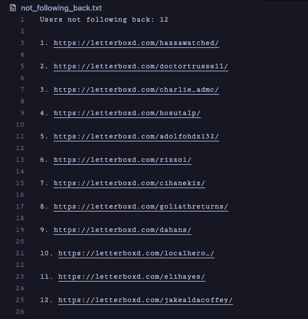

# Letterboxd Follow Back Checker

This Python script checks which users you follow on Letterboxd are not following you back. It utilizes BeautifulSoup and requests to scrape follower and following lists from your Letterboxd profile.

## Features

- Fetches followers and following lists from your Letterboxd profile.
- Identifies users who do not follow you back.
- Outputs the list of non-followers to a text file.

## Requirements

- Python 3.x
- `requests` library
- `beautifulsoup4` library

## Installation

1. Clone the repository:
    ```sh
    git clone https://github.com/wsjishan/letterboxd-follow-back-checker.git
    ```
2. Navigate to the project directory:
    ```sh
    cd letterboxd-follow-back-checker
    ```
3. Install the required libraries:
    ```sh
    pip install requests beautifulsoup4
    ```

## Usage

1. Run the script:
    ```sh
    python main.py
    ```
2. Enter your Letterboxd username when prompted.

The output will be saved to a file named `not_following_back.txt` in the project directory.

## Example Output
